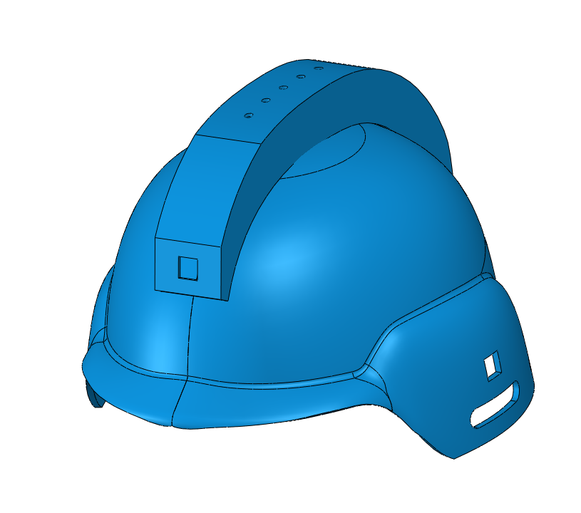
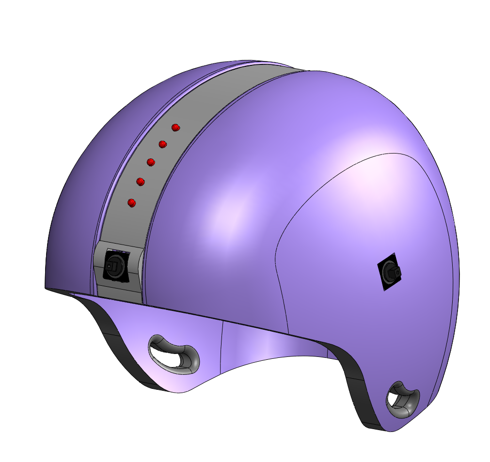
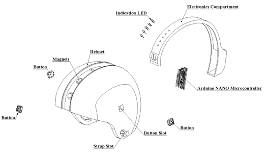
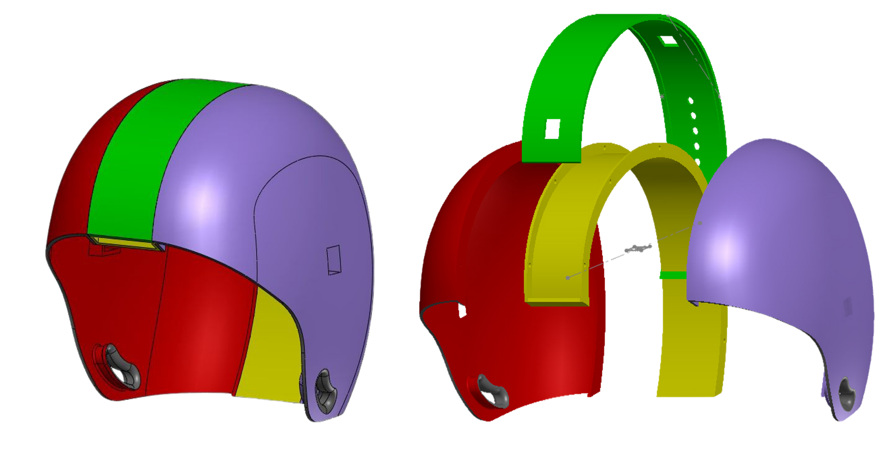
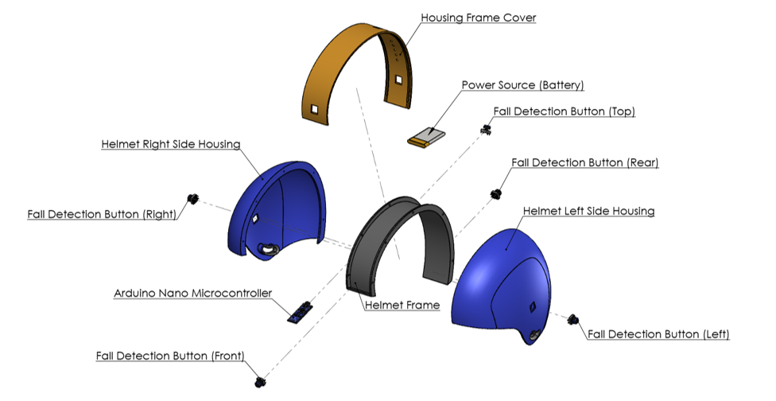
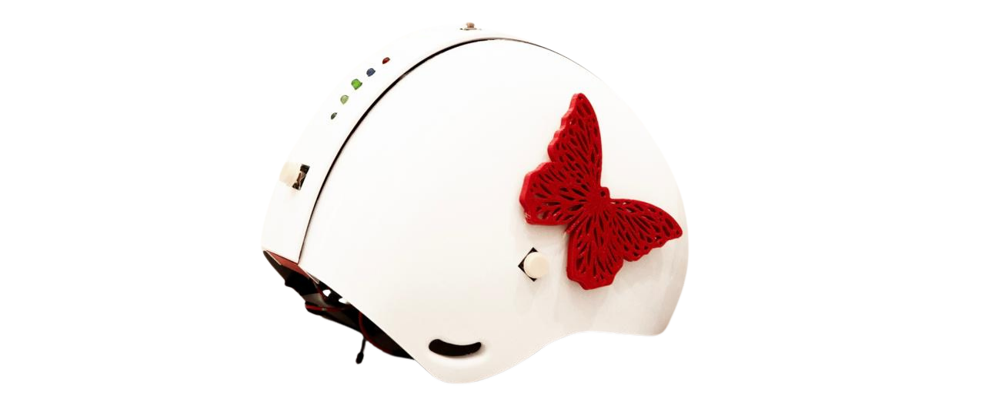

# Protective & Interactive Helmet for Children

A 3D-printed helmet designed to **protect children from fall-related head injuries**, featuring real-time LED fall-detection alerts and a therapeutic design to support proper cranial development.

---

## Overview

Children are highly vulnerable to head injuries from falls. This project addresses that risk by designing and manufacturing a helmet that is:

- **Protective** — absorbs and distributes impact forces
- **Interactive** — notifies parents immediately when a fall occurs

---

## Features

-  **4-directional fall detection** via push buttons (Front, Back, Left, Right)
-  **LED indicator** activates for 10 minutes upon detecting an impact
-  **Recyclable PLA material** — eco-friendly and lightweight
-  **Battery-powered** for portability

---

##  Tools & Technologies

| Category | Tool / Material |
|---|---|
| CAD Design | SolidWorks |
| 3D Slicing | Ultimaker Cura |
| 3D Printer | Ender 3 Pro |
| Microcontroller | Arduino Nano |
| Material | PLA Filament |

---

---

##  Gallery

###  First Edition
 

  

 
---
 
###  Second Edition
 

  <table>
    <tr>
      <td align="center"><b>Model</b></td>
      <td align="center"><b>Exploded View</b></td>
    </tr>
    <tr>
      <td></td>
      <td></td>
    </tr>
  </table>

 
---
 
###  Final Edition
 

  <table>
    <tr>
      <td align="center"><b>Model</b></td>
      <td align="center"><b>Exploded View</b></td>
      <td align="center"><b>Physical Prototype</b></td>
    </tr>
    <tr>
      <td></td>
      <td></td>
      <td></td>
    </tr>
  </table>

 
---

##  Publications & Posters
 
| Document | Event | Year |
|---|---|---|
| [ Conference Poster](ID140_Designing_and_Manufacturing_a_Protective_and_Interactive_Helmet_for_Children.pdf) | 3rd GCC International Conference on Industrial Engineering & Operations Management, Tabuk, Saudi Arabia | 2026 |
| [ Course Exhibition Poster](IE199_POSTER.pdf) | IE199 Course Project Exhibition — Mustaqbal University | 2024 |
| [ Statistics Report](Statistics_for_the_severity_of_head_injuries_in_children.pdf) | Community Survey: Severity of Head Injuries in Children (214 participants) | 2024 |

---
**Course:** Introduction to Engineering and Design — IE-199
---

##  License

This work is licensed under **Creative Commons Attribution-NonCommercial-NoDerivatives 4.0 International (CC BY-NC-ND 4.0)**.

© 2024 Sultanah Almutiri

You are free to **view and share** this work with proper attribution.
You may **not** use it commercially, modify it, or redistribute derivatives.

